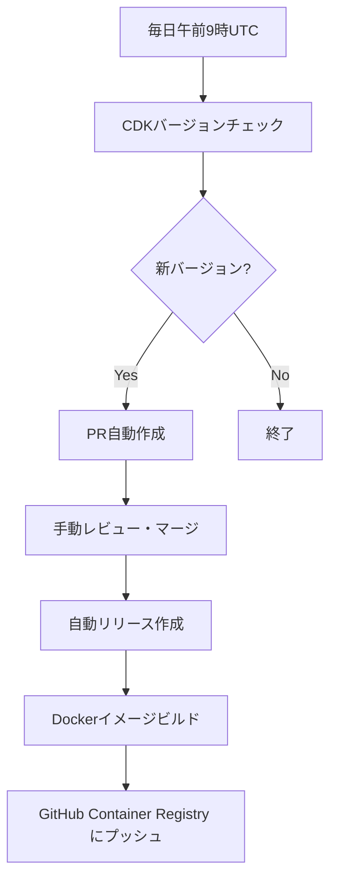

# AWS CDK 自動リリースワークフロー

このドキュメントでは、AWS CDK バージョンの自動更新とリリースのワークフローについて説明します。

## 概要

定期的にAWS CDKの新バージョンをチェックし、更新がある場合は自動的にPRを作成、マージ後にGitHubリリースとDockerイメージのビルド・プッシュを行うワークフローです。

## ワークフローの構成

### 1. CDK バージョンチェック (`check-cdk-updates.yml`)

**トリガー:**
- 毎日午前9時（UTC）に自動実行
- 手動実行も可能

**動作:**
1. `ghcr.io/nojimage/docker-cdk:2.24` コンテナを使用
2. コンテナ内の `cdk --version` でカレントバージョンを取得
3. `npm view aws-cdk@^2 version --json` で最新のCDK v2バージョンを取得
4. バージョンに差異がある場合、PRを自動作成

**PR作成内容:**
- `.cdk-version` ファイルの更新
- `README.md` 内のバージョン例の更新
- `example/README.md` 内のバージョン例の更新
- `example/docker-compose.yml` のイメージタグ更新
- `dependencies` ラベルを自動付与

### 2. 自動リリース作成 (`auto-release.yml`)

**トリガー:**
- `dependencies` ラベル付きPRのマージ

**動作:**
1. PRタイトルまたは `.cdk-version` ファイルからCDKバージョンを取得
2. バージョン変換（例：CDK 2.1027.0 → タグ 2.24.102700）
3. GitHubリリースを自動作成

### 3. Docker イメージビルド (`build-and-push.yml`)

**トリガー:**
- GitHubリリースの作成

**動作:**
1. マルチプラットフォーム（linux/amd64, linux/arm64）でDockerイメージをビルド
2. GitHub Container Registry（ghcr.io）にプッシュ
3. セマンティックバージョニングに基づくタグ付け

## バージョニング規則

### CDK バージョンからタグバージョンへの変換

```
CDK バージョン: 2.1027.0
↓
タグバージョン: 2.24.102700
```

**規則:**
- Major: CDKのMajorバージョン（2）
- Minor: Node.jsバージョン（24）
- Patch: CDKのMinorバージョン + Patchバージョン（2桁0パディング）

**変換例:**
- CDK 2.1031.0 → `2.24.103100`
- CDK 2.1031.1 → `2.24.103101`
- CDK 2.1031.12 → `2.24.103112`

### セマンティックバージョニング

- `v2.24.102700` - 特定バージョン（Git タグ）
- `2.24.102700` - 特定バージョン（Docker タグ）
- `2.24` - Minor最新
- `2` - Major最新
- `latest` - 全体最新（デフォルトブランチのみ）

## 設定要件

### 必須設定

1. **GitHub Actions 権限**
   ```
   Settings > Actions > General
   - Workflow permissions: "Read and write permissions"
   - "Allow GitHub Actions to create and approve pull requests" にチェック
   ```

2. **Personal Access Token（推奨）**
   ```
   Settings > Secrets and variables > Actions
   - Name: PAT_TOKEN
   - Value: repo権限を持つPersonal Access Token
   ```

### ファイル構成

```
.github/workflows/
├── check-cdk-updates.yml    # CDKバージョンチェック・PR作成
├── auto-release.yml         # 自動リリース作成
└── build-and-push.yml       # Dockerイメージビルド・プッシュ

.cdk-version                 # 現在のCDKバージョン追跡ファイル
```

## 実行フロー



## 手動操作

### 手動でのバージョンチェック実行

1. GitHub リポジトリの「Actions」タブを開く
2. 「Check CDK Updates」ワークフローを選択
3. 「Run workflow」ボタンをクリック
4. 手動実行

### 緊急時のマニュアル操作

1. **PRの手動作成**
   ```bash
   # .cdk-versionファイルを手動更新
   echo "2.1027.0" > .cdk-version
   
   # 関連ファイルの更新
   sed -i "s|2\.24\.[0-9]*|2.24.1027|g" README.md
   sed -i "s|2\.24\.[0-9]*|2.24.1027|g" example/README.md
   sed -i "s|2\.24\.[0-9]*|2.24.1027|g" example/docker-compose.yml
   ```

2. **リリースの手動作成**
   - GitHub の「Releases」から「Create a new release」
   - タグ形式：`v2.24.102700`
   - `dependencies` ラベルを含むPRをマージした場合と同じ動作

## トラブルシューティング

### よくある問題

1. **PR作成権限エラー**
   ```
   GitHub Actions is not permitted to create or approve pull requests.
   ```
   **解決方法:** Personal Access Token の設定、または Actions 権限の有効化

2. **バージョン取得エラー**
   ```
   npm view aws-cdk@^2 version --json | jq -r '.[-1]'
   ```
   **確認点:** コンテナ内での npm および jq コマンドの動作

3. **Docker ビルドエラー**
   **確認点:** Dockerfile の構文、ベースイメージの可用性

### ログの確認方法

1. GitHub の「Actions」タブでワークフロー実行履歴を確認
2. 各ステップのログを展開して詳細を確認
3. エラーメッセージから原因を特定

## メンテナンス

### 定期確認項目

- [ ] ワークフローが正常に実行されているか
- [ ] エラーが発生していないか  
- [ ] CDKバージョンが適切に更新されているか
- [ ] Dockerイメージが正しくプッシュされているか

### 更新が必要な場合

- Node.js バージョンの変更時：ワークフロー内の `NODE_VERSION` を更新
- ベースイメージの変更時：`Dockerfile` および関連ドキュメントを更新
- CDK Major バージョンアップ時：バージョニング規則の見直し